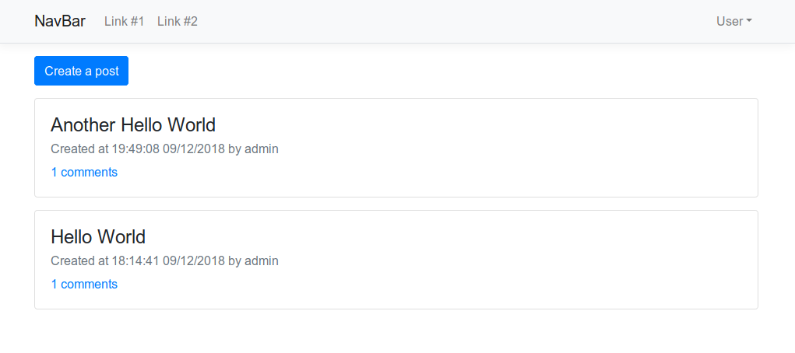
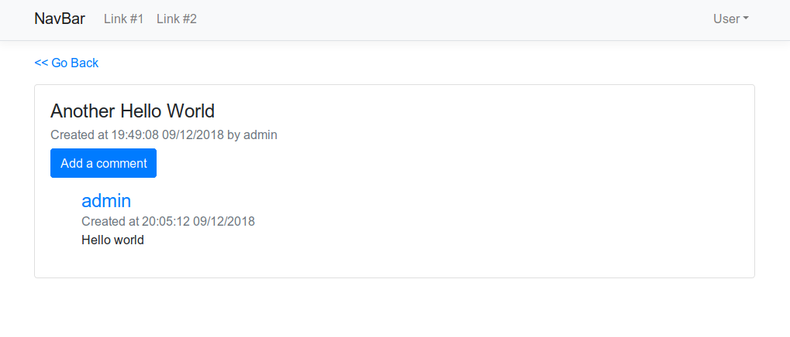
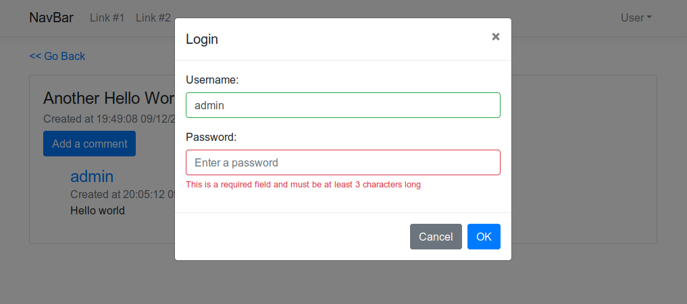

# Serverless AWS Node.js Boostrap-vue

## Introduction

This is a [Serverless](https://serverless.com/) example using Node.js as the backend and Bootstrap-vue (Bootstrap 4 + Vue.js 2.4 - without webpack) as the front end. This is a slightly more advanced example showing a simple Post/Comment web app, including user authentication. Additionally, both the front end nad back end are served through the API Gateway, no need to use AWS CloudFront.

Dont know what serverless is? [Read here](https://serverless.com/)

**Please be aware that this is using "production" stage only! Using different stages will break the front end. To fix it, simply find all occurances of "production/rest" in Vue files, and replace it with "dev/rest" or whatever you wish. Additionally, in "vue.config.js" change the "baseUrl" from "/production/assets/" to "/dev/assets" or whatever you need to.**

## Why?

The [Serverless framework](https://serverless.com/) does have an extensive [example repository](https://github.com/serverless/examples) but none of those examples explain how to connect the AWS Lambda with the front end using Vue.js. So I have decided to create a simple Post/Comment web app.

## Features

* [Serverless framework](https://serverless.com/) to handle the backend with [AWS](https://aws.amazon.com/) as the provider and [Node.js](https://serverless.com/framework/docs/providers/aws/guide/quick-start/) as the target language.
* [Bootstrap-vue](https://bootstrap-vue.js.org/) as the frontend (with Boostrap 4 and Vue 2.4 without using webpack configuration)
* User authentication using [jsonwebtoken](https://www.npmjs.com/package/jsonwebtoken) and [bcryptjs](https://www.npmjs.com/package/bcryptjs)
* [DynamoDB](https://aws.amazon.com/dynamodb/) for storing data
* Serving the front end through AWS API Gateway thanks to [serverless-apig-s3](https://www.npmjs.com/package/serverless-apig-s3) plugin. No need to use AWS CloudFront for serving REST API and the front end separately.

## Does not do

* Dynamic page load (all pages are loaded from S3 through API Gateway, therefore lambda is not used -> no dynamic pages)
* Front End caching (the necessary Cache-Control header is missing, this is due to the apig-s3 library)
* User input validation (there are many different libraries to handle this, pick one if you need to)
* Unit tests (but should be easy to add)
* Locally runnable (you will have to add the necessary plugins yourself)

## Screenshots

*Screenshot: Index page:*


*Screenshot: Post page:*


*Screenshot: Login dialog:*


## Instructions

**You must have an active AWS account and awscli installed in your OS, including AWS credentials.**

Clone this repository:

```bash
git clone https://github.com/matusnovak/serverless-aws-node-bootstrap-vue
```

Go to the cloned repository and install the dependencies:

```bash
cd serverless-aws-node-bootstrap-vue
npm install
```

Deploy the back end first:

```bash
# In the serverless-aws-node-bootstrap-vue folder
npm run deploy:server
# This is same as: serverless deploy --stage production
```

Once deployed, you should see something as the following:

```
endpoints:
  POST - https://xxxxxxxxxx.execute-api.us-east-1.amazonaws.com/production/rest/user/register
  POST - https://xxxxxxxxxx.execute-api.us-east-1.amazonaws.com/production/rest/user/login
...more...
```

Copy the `https://xxxxxxxxxx.execute-api.us-east-1.amazonaws.com/production` where the `xxxxxxxxxx` is some random string of letters and numbers.

Then deploy the front end as the last step:

```bash
# In the serverless-aws-node-bootstrap-vue folder
npm run deploy:client
# This is same as: serverless client deploy --stage production
```

Then open your browser and go to the url you have copied in the previous step. That's it!

**Please be aware that this is using "production" stage only! Using different stages will break the front end. To fix it, simply find all occurances of "production/rest" in Vue files, and replace it with "dev/rest" or whatever you wish. Additionally, in "vue.config.js" change the "baseUrl" from "/production/assets/" to "/dev/assets" or whatever you need to.**

## License

MIT License

Copyright 2018 matusnov@gmail.com

Permission is hereby granted, free of charge, to any person obtaining a copy of this software and associated documentation files (the "Software"), to deal in the Software without restriction, including without limitation the rights to use, copy, modify, merge, publish, distribute, sublicense, and/or sell copies of the Software, and to permit persons to whom the Software is furnished to do so, subject to the following conditions:

The above copyright notice and this permission notice shall be included in all copies or substantial portions of the Software.

THE SOFTWARE IS PROVIDED "AS IS", WITHOUT WARRANTY OF ANY KIND, EXPRESS OR IMPLIED, INCLUDING BUT NOT LIMITED TO THE WARRANTIES OF MERCHANTABILITY, FITNESS FOR A PARTICULAR PURPOSE AND NONINFRINGEMENT. IN NO EVENT SHALL THE AUTHORS OR COPYRIGHT HOLDERS BE LIABLE FOR ANY CLAIM, DAMAGES OR OTHER LIABILITY, WHETHER IN AN ACTION OF CONTRACT, TORT OR OTHERWISE, ARISING FROM, OUT OF OR IN CONNECTION WITH THE SOFTWARE OR THE USE OR OTHER DEALINGS IN THE SOFTWARE.